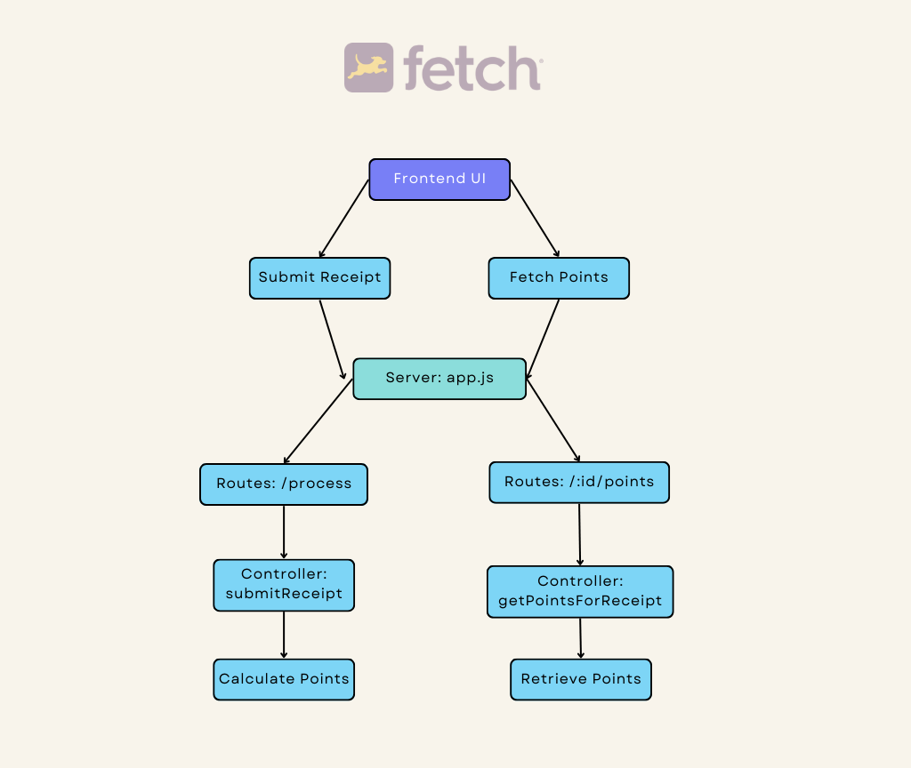
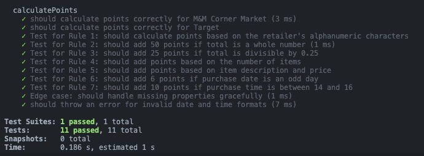

# Fetch Rewards Application 🛍️

## Introduction 📖

Fetch Rewards is an innovative application that allows users to earn points by scanning their shopping receipts. By simply taking a photo of a receipt, the app scans and fetches details such as the retailer, purchase date, purchase time, total, item description, and item price. Based on the items and total amount, users are awarded points which they can later redeem for rewards.

## Tech Stack 🛠️

- **Frontend**: React
- **Styling**: Tailwind.css
- **Backend**: Node and Express
- **Unit Testing**: Jest

## Demo 🪄


## Folder Structure 📂

```perl
fetch-rewards/
│
├── node_modules/
├── public/                  # Static contents like logos
│
├── server/                  # Backend server code
│   ├── node_modules/
│   ├── src/
│   │   ├── controller/     # Methods to process data
│   │   ├── routes/         # API endpoints
│   │   └── app.js          # Main server file
│   ├── tests/              # Unit tests for backend code
│   ├── package.json
│   └── package-lock.json
│
├── src/                     # Frontend code
│   ├── pages/
│   │   └── receipt-form/   # UI for entering receipt details
│   ├── app.css
│   ├── app.jsx
│   ├── index.css
│   └── main.jsx            # Renders the receipt form
│
├── .gitignore
├── index.html
├── package-lock.json
├── package.json
├── webpack.config.js
├── README.md               # Updated README with front-end and backend documentation
└── tailwindconfig.js

```

## Code Optimization and Efficiency 🚀

1. Caching: The code uses caching to store the results of previous computations. This ensures that if the same data is processed multiple times, the result is retrieved from the cache without recalculating, making subsequent calls to `calculatePoints` with the same data O(1).

2. Validation: The code uses both RegEx and Moment.js for date and time validation. While RegEx is faster, Moment.js provides more comprehensive date validation. (We can choose either method based on the requirement).

3. In-Memory Storage: The code uses in-memory storage (via the `receipts` object) for quick retrieval of data. This is efficient for small datasets but might not scale well for large datasets. For larger datasets, a database or persistent storage solution would be more appropriate.

## Application Flow 🌊



- **Frontend**:
  - The main entry point is `main.jsx` which renders the `ReceiptForm` component.
  - Users can input receipt details in the `ReceiptForm` component.
  - On form submission, the data is sent to the server for processing.
  - Users can also fetch points associated with the receipt.
- **Backend**:
  - The main server file is `app.js` which sets up the Express server and routes.
  - The route `/api/receipts` redirects to `receiptRoutes.js`.
  - Inside `receiptRoutes.js`, there are two main routes: `process` and `:id/points`.
  - These routes are handled by methods in `receiptController.js`:
    - `submitReceipt`: Handles the receipt submission.
    - `getPointsForReceipt`: Fetches points for a given receipt ID.

## Utility Functions

- `resetForm`: Resets all form fields to their initial state.
- `addNewItem`: Adds a new item to the receipt.
- `removeItem`: Removes an item from the receipt based on its index.
- `fetchPoints`: Fetches points for a given receipt ID from the server.
- `handleSubmit`: Handles the form submission, sends data to the server, and provides visual feedback.

## Component States

- `showConfetti`: Controls the display of the confetti animation.
- `retailer`, `purchaseDate`, `purchaseTime`, `total`: Form fields for receipt details.
- `items`: An array of items purchased.
- `response`: Stores the server's response after submitting the receipt.
- `showGif`: Controls the display of a GIF.
- `points`: Stores the points fetched from the server.

## Visual Feedback

- Confetti animation is displayed when points are successfully fetched.
- A GIF is displayed for 2 seconds during form submission.
- Toast notifications provide feedback on form submission and fetching points.

# Validation Logic 🛡️

I was able to validate the purchase date and time using two methods:

1. Regex: Quickly checks the basic format.

- Date: YYYY-MM-DD
- Time: HH:MM

2. Moment.js: Ensures valid and logical date/time values.

Any discrepancies result in an error.

## Test Cases 🧪

I have designed a set of unit tests to ensure the robustness and accuracy of the point calculation system. Here's a brief summary of the test cases:

1. Validates point calculation for a receipt from "M&M Corner Market".
2. Validates point calculation for a receipt from "Target".
3. Checks point addition based on the alphanumeric characters in the retailer's name.
4. Ensures 50 points are added if the total amount is a whole number.
5. Confirms 25 points are added if the total amount is divisible by 0.25.
6. Validates point addition based on the number of items in the receipt.
7. Checks point calculation based on item description length and its price.
8. Adds 6 points if the purchase date falls on an odd day.
9. Grants 10 points for purchases made between 2:00 pm and 4:00 pm.
10. Handles receipts with missing properties without errors.

These tests help in maintaining the integrity of the application and ensuring a consistent user experience.



# Running the Service Locally 🚀

## Conclusion 🌟

My Fetch Rewards application is designed to be user-friendly and efficient. With a combination of unit tests and a UI, users can easily test and experience the functionality. The added animations and feedback mechanisms ensure a delightful user experience. I hope you find this documentation helpful!
